<div>
	
	<div align="center"><strong>Universidad de San Carlos de Guatemala</strong></div>
</div>
<br clear="all" />

<div align="center">
	<strong>Facultad de Ingeniería</strong><br/>
	<br/>
	<strong>LABORATORIO REDES DE COMPUTADORES 2</strong><br/>
	<strong>Sección N</strong><br/>
	<br/>
    <br/>
    <h3><strong>Proyecto 1</strong><br/></h3>
    <br/>
	<strong>Estudiante:</strong><br/>
	Anyelo Gustavo Hernández Ayala 201807398<br/>
</div>


| | |
|---|---|
| Carné | 201807398 |
| Paridad del carné | protocolo **OSPF** |
| Octeto X asignado | **98** |
| Redes base | 192.188.98.0/24 y 10.4.98.0/24 |
| Herramienta | Cisco Packet Tracer |

---

## Tabla de contenido

1. [Descripción general](#1-descripción-general)
2. [Topología](#2-topología)
3. [Inventario de equipos](#3-inventario-de-equipos)
4. [Direccionamiento IP](#4-direccionamiento-ip)
   - 4.1 [Subnetting VLSM para VLANs](#41-subnetting-vlsm-para-vlans)
   - 4.2 [Subnetting FLSM para enlaces](#42-subnetting-flsm-para-enlaces)
5. [VTP](#5-vtp-vlan-trunking-protocol)
6. [Agregación de enlaces](#6-agregación-de-enlaces)
   - 6.1 [LACP Edificio Izquierdo](#61-lacp--edificio-izquierdo)
   - 6.2 [PAgP Edificio Derecho](#62-pagp--edificio-derecho)
7. [Enrutamiento dinámico OSPF](#7-enrutamiento-dinámico-ospf)
8. [Servicios DHCP](#8-servicios-dhcp)
9. [Listas de control de acceso](#9-listas-de-control-de-acceso-acls)
10. [Spanning Tree Protocol](#10-spanning-tree-protocol)
11. [Pruebas de conectividad](#11-pruebas-de-conectividad)
12. [Pruebas de tolerancia a fallos](#12-pruebas-de-tolerancia-a-fallos)
13. [Resumen de comandos por área](#13-resumen-de-comandos-por-área)

---

## 1. Descripción general

Chapin Red es una organización dedicada a proyectos de ayuda humanitaria que opera desde cuatro edificios dentro de una misma área metropolitana. Este proyecto implementa la infraestructura de red completa: segmentación por VLANs, direccionamiento con VLSM y FLSM, redundancia mediante agregación de enlaces, enrutamiento dinámico entre edificios y políticas de seguridad con ACLs.

La red se organiza así:

- **Edificio Izquierdo** — arquitectura jerárquica de tres capas (Core, Distribución y Acceso) con cinco EtherChannels LACP.
- **Edificio Derecho** — tres EtherChannels PAgP más un enlace agregado de capa 3 hacia el núcleo.
- **Edificio de Administración** — alberga la VLAN ADMIN con acceso privilegiado al resto de la red.
- **Núcleo MAN** — cuatro switches multicapa Cisco 3650 interconectados por fibra óptica Gigabit.

---

## 2. Topología

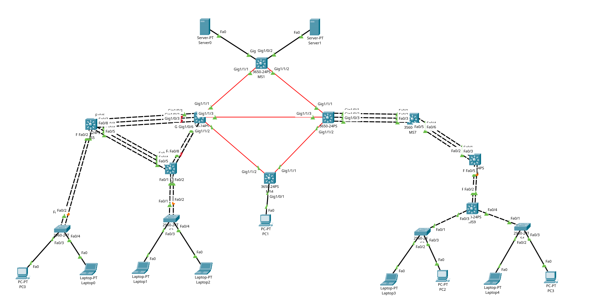

---

## 3. Inventario de equipos

| Dispositivo | Modelo | Rol | Ubicación |
|---|---|---|---|
| MS1 | Cisco 3650-24PS | Núcleo MAN / acceso a servidores | Núcleo |
| MS2 | Cisco 3650-24PS | Núcleo MAN | Núcleo |
| MS3 | Cisco 3650-24PS | Núcleo MAN / enlace a edificio derecho | Núcleo |
| MS4 | Cisco 3650-24PS | Gateway VLAN ADMIN | Edificio Administración |
| MS5 | Cisco 3560-24PS | Core y gateway inter-VLAN | Edificio Izquierdo |
| MS6 | Cisco 3560-24PS | Distribución | Edificio Izquierdo |
| MS7 | Cisco 3560-24PS | Core y gateway inter-VLAN | Edificio Derecho |
| MS8 | Cisco 3560-24PS | Distribución | Edificio Derecho |
| MS9 | Cisco 3560-24PS | Distribución | Edificio Derecho |
| S1, S2 | Cisco 2960-24TT | Acceso | Edificio Izquierdo |
| S3, S4 | Cisco 2960-24TT | Acceso | Edificio Derecho |
| Server0 | Server-PT | Servidor DHCP izquierdo | Núcleo (MS1) |
| Server1 | Server-PT | Servidor DHCP derecho | Núcleo (MS1) |

---

## 4. Direccionamiento IP

### 4.1 Subnetting VLSM para VLANs

Se aplicó VLSM sobre 192.188.98.0/24, ordenando las subredes de mayor a menor requerimiento de hosts para aprovechar el espacio sin desperdicio.

| VLAN | Nombre | Hosts | Red | Máscara | Gateway | Rango usable | Broadcast |
|---|---|---|---|---|---|---|---|
| 10 | VLAN_Naranja_EdificioIZQ_201807398 | 50 | 192.188.98.0 | /26 (255.255.255.192) | .1 | .2 – .62 | .63 |
| 20 | VLAN_Verde_EdificioIZQ_201807398 | 25 | 192.188.98.64 | /27 (255.255.255.224) | .65 | .66 – .94 | .95 |
| 30 | VLAN_Naranja_EdificioDER_201807398 | 25 | 192.188.98.96 | /27 (255.255.255.224) | .97 | .98 – .126 | .127 |
| 40 | VLAN_Verde_EdificioDER_201807398 | 12 | 192.188.98.128 | /28 (255.255.255.240) | .129 | .130 – .142 | .143 |
| 99 | VLAN_ADMIN_201807398 | 6 | 192.188.98.144 | /29 (255.255.255.248) | .145 | .146 – .150 | .151 |
| 50 | VLAN_Servidores_201807398 | 6 | 192.188.98.152 | /29 (255.255.255.248) | .153 | .154 – .158 | .159 |

La VLAN 50 no forma parte del requerimiento original. Se agregó porque los servidores DHCP necesitan un segmento propio con dirección alcanzable desde toda la red para que funcione el relay.

### 4.2 Subnetting FLSM para enlaces

Los enlaces punto a punto usan FLSM con máscara fija /30, que provee exactamente dos direcciones utilizables por enlace.

| Enlace | Red | Extremo A | Extremo B |
|---|---|---|---|
| MS1 – MS2 | 10.4.98.0/30 | MS1: .1 | MS2 Gi1/1/1: .2 |
| MS1 – MS3 | 10.4.98.4/30 | MS1: .5 | MS3 Gi1/1/1: .6 |
| MS2 – MS3 | 10.4.98.8/30 | MS2 Gi1/1/3: .9 | MS3 Gi1/1/3: .10 |
| MS2 – MS4 | 10.4.98.12/30 | MS2 Gi1/1/2: .13 | MS4 Gi1/1/2: .14 |
| MS3 – MS4 | 10.4.98.16/30 | MS4 Gi1/1/1: .17 | MS3 Gi1/1/2: .18 |
| MS2 – MS5 (Po1) | 10.4.98.28/30 | MS5 Po1: .29 | MS2 Po1: .30 |
| MS3 – MS7 (Po1) | 10.4.98.32/30 | MS7 Po1: .33 | MS3 Po1: .34 |
| MS2 – MS6 (Po2/Po3) | 10.4.98.36/30 | MS6 Po3: .37 | MS2 Po2: .38 |

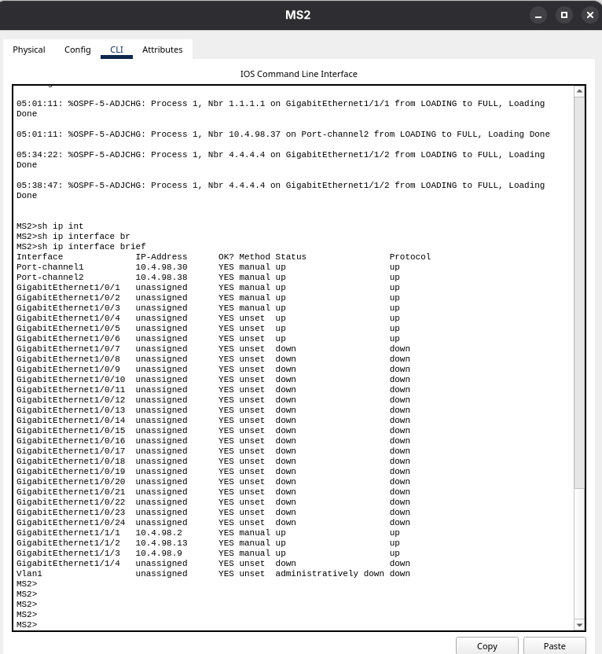

---

## 5. VTP (VLAN Trunking Protocol)

| Parámetro | Valor |
|---|---|
| Dominio | ChapinRed |
| Contraseña | Red201807398 |
| Versión | 2 |

### Roles asignados

| Modo | Switches | Justificación |
|---|---|---|
| Server | MS5, MS7 | Uno por edificio |
| Client | MS6, S1, S2, MS8, MS9, S3, S4 | Reciben la base de VLANs sin modificarla |
| Transparent | MS1, MS2, MS3, MS4 | Núcleo de capa 3 sin enlaces troncales |

Se configuraron dos servidores VTP porque los edificios izquierdo y derecho no comparten un camino continuo de capa 2. Los enlaces MS2–MS5, MS2–MS6 y MS3–MS7 son enlaces ruteados, y VTP solo propaga su base de datos a través de enlaces troncales. Ambos servidores operan en el mismo dominio con la misma contraseña.

MS1 opera en modo transparent y crea localmente la VLAN 50 para los servidores. MS4 hace lo mismo con la VLAN 99, ya que un switch en modo client no puede crear VLANs.

### Comandos

```
! --- Servidor VTP (MS5) ---
configure terminal
vtp domain ChapinRed
vtp version 2
vtp password Red201807398
vtp mode server
vlan 10
 name VLAN_Naranja_EdificioIZQ_201807398
exit
vlan 20
 name VLAN_Verde_EdificioIZQ_201807398
end
write memory

! --- Servidor VTP (MS7) ---
configure terminal
vtp domain ChapinRed
vtp version 2
vtp password Red201807398
vtp mode server
vlan 30
 name VLAN_Naranja_EdificioDER_201807398
exit
vlan 40
 name VLAN_Verde_EdificioDER_201807398
end
write memory

! --- Cliente VTP (MS6, MS8, MS9, S1, S2, S3, S4) ---
configure terminal
vtp domain ChapinRed
vtp version 2
vtp password Red201807398
vtp mode client
end
write memory

! --- Transparent (MS1, MS2, MS3, MS4) ---
configure terminal
vtp domain ChapinRed
vtp version 2
vtp mode transparent
end
write memory
```

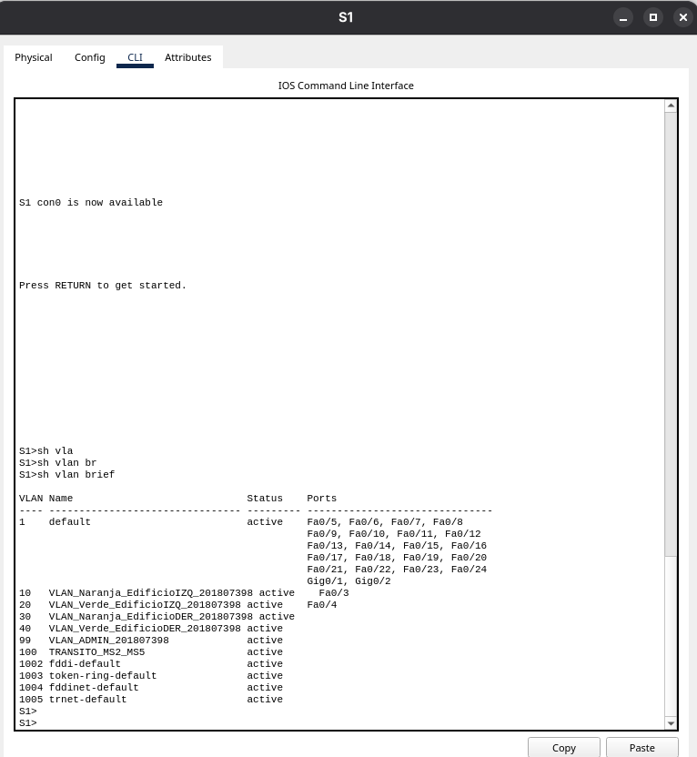
---

## 6. Agregación de enlaces

### 6.1 LACP — Edificio Izquierdo

Cinco EtherChannels con LACP, todos en modo `active` en ambos extremos.

| # | Enlace | Puertos extremo A | Puertos extremo B | Capa |
|---|---|---|---|---|
| 1 | MS5 Po1 – MS2 Po1 | MS5 Fa0/6-8 | MS2 Gi1/0/1-3 | 3 (ruteado) |
| 2 | MS6 Po3 – MS2 Po2 | MS6 Fa0/6-8 | MS2 Gi1/0/4-6 | 3 (ruteado) |
| 3 | MS5 Po2 – MS6 Po1 | MS5 Fa0/3-5 | MS6 Fa0/3-5 | 2 (troncal) |
| 4 | MS5 Po3 – S1 Po1 | MS5 Fa0/1-2 | S1 Fa0/1-2 | 2 (troncal) |
| 5 | MS6 Po2 – S2 Po1 | MS6 Fa0/1-2 | S2 Fa0/1-2 | 2 (troncal) |

```
! --- EtherChannel de capa 3 (MS5 hacia MS2) ---
configure terminal
interface range FastEthernet0/6-8
 no switchport
 channel-group 1 mode active
 no shutdown
exit
interface Port-channel1
 ip address 10.4.98.29 255.255.255.252
 no shutdown
end
write memory

! --- EtherChannel de capa 2 (MS5 hacia MS6) ---
configure terminal
interface range FastEthernet0/3-5
 switchport
 switchport trunk encapsulation dot1q
 switchport mode trunk
 channel-group 2 mode active
 no shutdown
exit
interface Port-channel2
 switchport trunk encapsulation dot1q
 switchport mode trunk
end
write memory

! --- Lado del switch de acceso (S1, modelo 2960) ---
configure terminal
interface range FastEthernet0/1-2
 switchport mode trunk
 channel-group 1 mode active
exit
interface Port-channel1
 switchport mode trunk
end
write memory
```

Consideraciones aprendidas durante la implementación:

- El comando `no switchport` o `switchport` debe aplicarse a los puertos físicos **antes** del `channel-group`. El Port-channel hereda la capa de sus miembros y no puede convertirse después.
- Los switches 2960 no soportan `switchport trunk encapsulation dot1q` porque solo manejan 802.1Q.
- Los números de Port-channel son locales a cada switch y no necesitan coincidir entre extremos.

### 6.2 PAgP — Edificio Derecho

Tres EtherChannels de capa 2 con PAgP más uno de capa 3 hacia el núcleo, todos en modo `desirable` en ambos extremos.

| # | Enlace | Puertos extremo A | Puertos extremo B | Capa |
|---|---|---|---|---|
| 1 | MS3 Po1 – MS7 Po1 | MS3 Gi1/0/1-3 | MS7 Fa0/1-3 | 3 (ruteado) |
| 2 | MS7 Po2 – MS8 Po1 | MS7 Fa0/4-6 | MS8 Fa0/1-3 | 2 (troncal) |
| 3 | MS8 Po3 – MS9 Po1 | MS8 Fa0/4-5 | MS9 Fa0/1-2 | 2 (troncal) |
| 4 | MS9 Po2 – S3 Po1 | MS9 Fa0/3, Fa0/5 | S3 Fa0/1, Fa0/4 | 2 (troncal) |

```
! --- EtherChannel PAgP de capa 3 (MS7 hacia MS3) ---
configure terminal
interface range FastEthernet0/1-3
 no switchport
 channel-group 1 mode desirable
 no shutdown
exit
interface Port-channel1
 ip address 10.4.98.33 255.255.255.252
 no shutdown
end
write memory

! --- EtherChannel PAgP de capa 2 (MS8 hacia MS9) ---
configure terminal
interface range FastEthernet0/4-5
 switchport trunk encapsulation dot1q
 switchport mode trunk
 channel-group 3 mode desirable
 no shutdown
exit
interface Port-channel3
 switchport trunk encapsulation dot1q
 switchport mode trunk
end
write memory
```

El EtherChannel MS3–MS7 se configuró como interfaz de capa 3 con `no switchport` y direccionamiento IP, tal como exige el enunciado, en lugar de usar una VLAN de tránsito sobre una troncal.

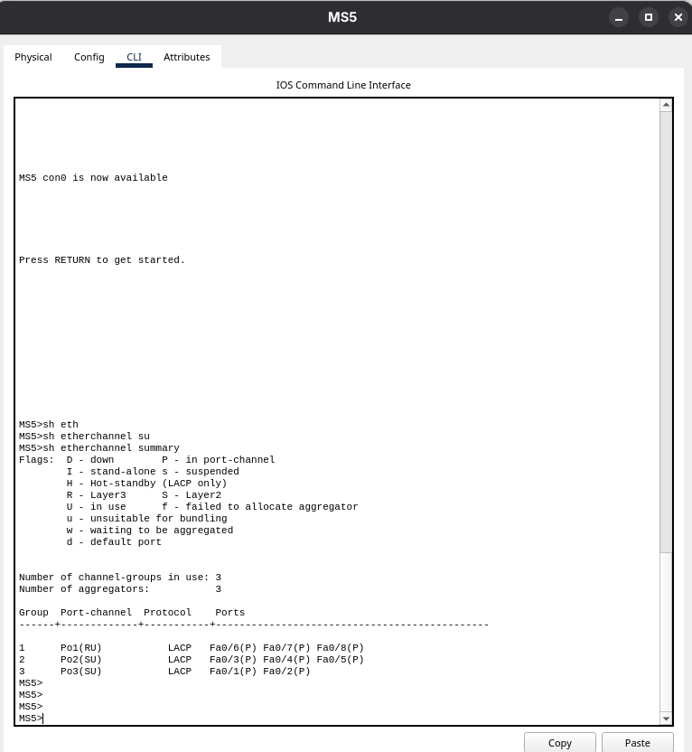

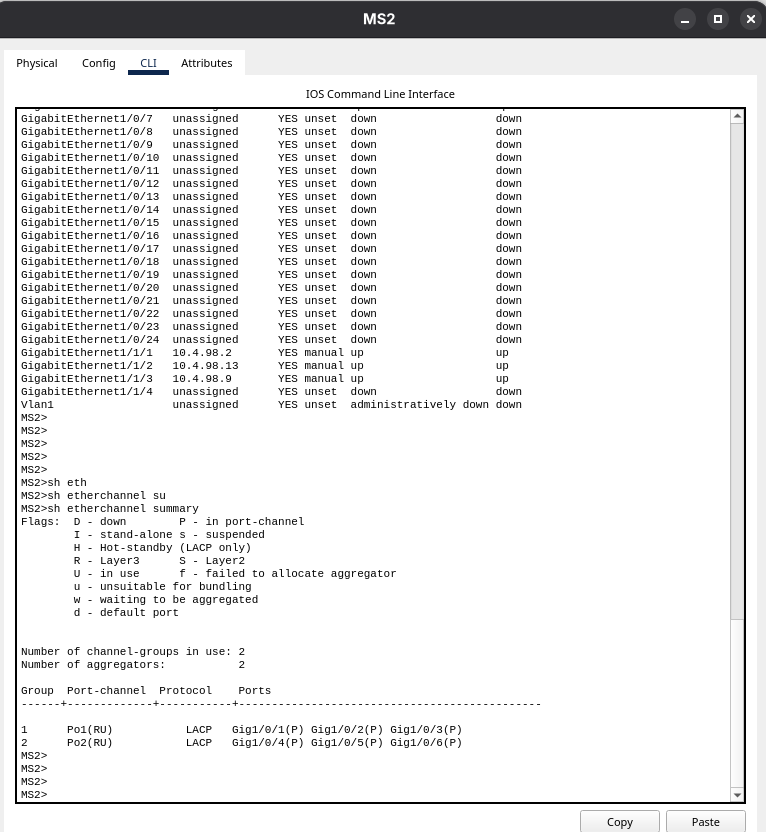

---

## 7. Enrutamiento dinámico OSPF

Se utilizó OSPF por corresponder a carné par. Toda la red opera en un único área backbone (área 0).

### Router-ID asignados

| Switch | Router-ID |
|---|---|
| MS1 | 1.1.1.1 |
| MS2 | 2.2.2.2 |
| MS3 | 3.3.3.3 |
| MS4 | 4.4.4.4 |
| MS5 | 5.5.5.5 |
| MS6 | 6.6.6.6 |
| MS7 | 7.7.7.7 |

Los Router-ID se fijaron manualmente porque OSPF los calcula tomando la IP más alta disponible al iniciar el proceso, y no los recalcula al cambiar la configuración. Esto provocó una colisión de identificadores entre MS2 y MS4 que dejó la adyacencia atorada en estado EXSTART hasta corregirla.

### Redes anunciadas por dispositivo

| Switch | Redes |
|---|---|
| MS1 | 10.4.98.0/30, 10.4.98.4/30, 192.188.98.152/29 |
| MS2 | 10.4.98.0/30, 10.4.98.8/30, 10.4.98.12/30, 10.4.98.28/30, 10.4.98.36/30 |
| MS3 | 10.4.98.4/30, 10.4.98.8/30, 10.4.98.16/30, 10.4.98.32/30 |
| MS4 | 10.4.98.12/30, 10.4.98.16/30, 192.188.98.144/29 |
| MS5 | 10.4.98.28/30, 192.188.98.0/26, 192.188.98.64/27 |
| MS6 | 10.4.98.36/30 |
| MS7 | 10.4.98.32/30, 192.188.98.96/27, 192.188.98.128/28 |

Cada red se anuncia únicamente en el switch que posee la interfaz correspondiente.

```
! --- Configuración OSPF en un switch de edificio (MS5) ---
configure terminal
ip routing
router ospf 1
 router-id 5.5.5.5
 network 10.4.98.28 0.0.0.3 area 0
 network 192.188.98.0 0.0.0.63 area 0
 network 192.188.98.64 0.0.0.31 area 0
 passive-interface Vlan10
 passive-interface Vlan20
end
write memory
clear ip ospf process
```

Notas de implementación:

- Los switches 3560 requieren `ip routing` habilitado explícitamente. Sin este comando el proceso OSPF ni siquiera existe.
- Las SVIs de usuarios se declaran pasivas para no enviar hellos hacia las PCs.
- Packet Tracer no acepta interfaces Port-channel en el comando `passive-interface`. En los switches donde estaba configurado `passive-interface default` fue necesario retirarlo para que los EtherChannels ruteados formaran adyacencia.
- El cambio de Router-ID requiere `clear ip ospf process` para tomar efecto.

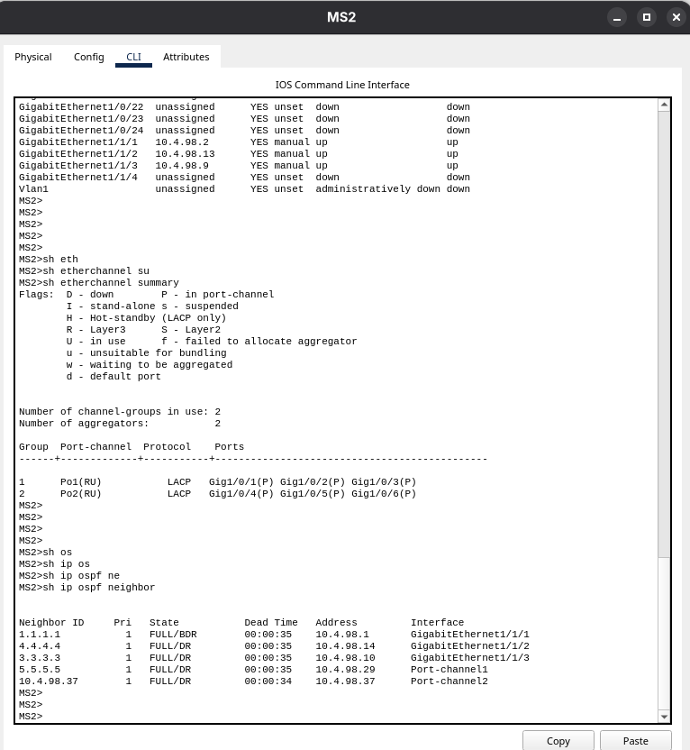
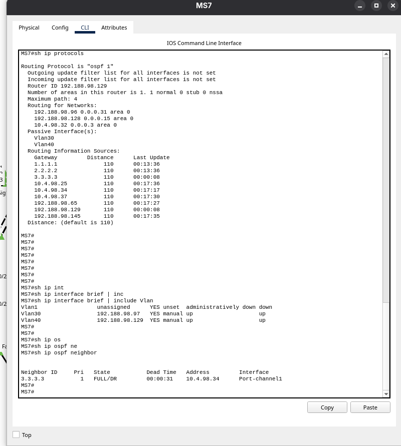
---

## 8. Servicios DHCP

Todos los dispositivos finales obtienen su dirección de forma dinámica. No hay direccionamiento estático en PCs ni laptops.

### Servidores

| Servidor | Dirección | Máscara | Gateway | Atiende |
|---|---|---|---|---|
| Server0 | 192.188.98.154 | 255.255.255.248 | 192.188.98.153 | Edificio Izquierdo y ADMIN |
| Server1 | 192.188.98.155 | 255.255.255.248 | 192.188.98.153 | Edificio Derecho |

### Pools configurados

**Server0**

| Pool | Gateway | IP inicial | Máscara | Usuarios |
|---|---|---|---|---|
| POOL_NARANJA_IZQ | 192.188.98.1 | 192.188.98.10 | 255.255.255.192 | 40 |
| POOL_VERDE_IZQ | 192.188.98.65 | 192.188.98.70 | 255.255.255.224 | 20 |
| POOL_ADMIN | 192.188.98.145 | 192.188.98.147 | 255.255.255.248 | 4 |

**Server1**

| Pool | Gateway | IP inicial | Máscara | Usuarios |
|---|---|---|---|---|
| POOL_NARANJA_DER | 192.188.98.97 | 192.188.98.105 | 255.255.255.224 | 20 |
| POOL_VERDE_DER | 192.188.98.129 | 192.188.98.133 | 255.255.255.240 | 8 |

### DHCP Relay

Las peticiones DHCP viajan como broadcast y no atraviesan routers. El comando `ip helper-address` las convierte en unicast dirigido al servidor correspondiente.

| Switch | Interfaz | Helper-address |
|---|---|---|
| MS5 | Vlan10 | 192.188.98.154 |
| MS5 | Vlan20 | 192.188.98.154 |
| MS7 | Vlan30 | 192.188.98.155 |
| MS7 | Vlan40 | 192.188.98.155 |
| MS4 | Vlan99 | 192.188.98.154 |

```
! --- DHCP Relay en MS5 ---
configure terminal
interface Vlan10
 ip address 192.188.98.1 255.255.255.192
 ip helper-address 192.188.98.154
exit
interface Vlan20
 ip address 192.188.98.65 255.255.255.224
 ip helper-address 192.188.98.154
end
write memory
```

Un detalle importante: para que el DHCP funcione no basta con el helper-address. La red de la VLAN debe estar anunciada en OSPF, porque de lo contrario el servidor recibe la petición pero su respuesta no tiene ruta de retorno.

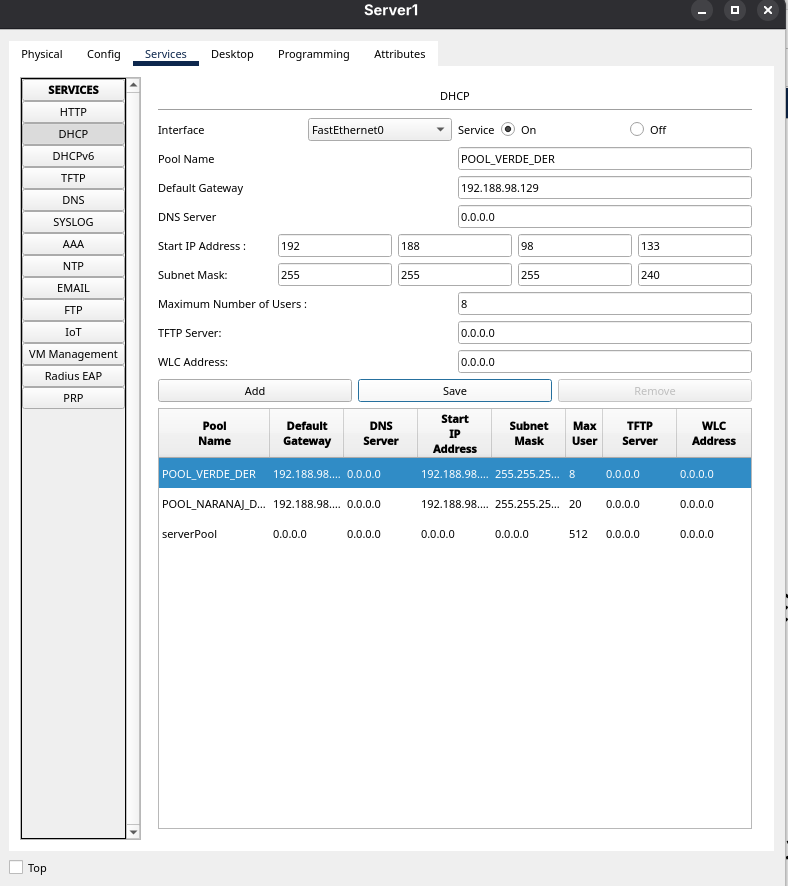
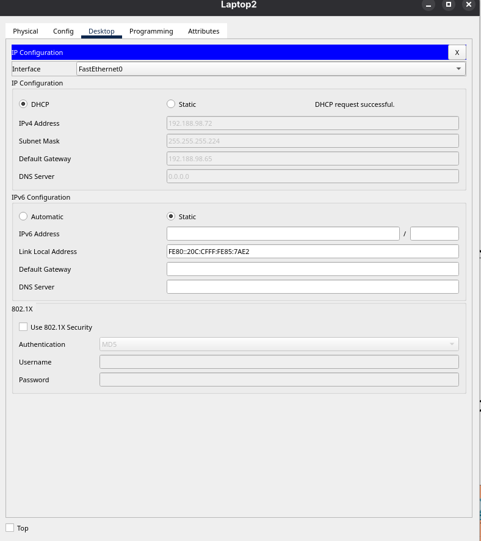

---

## 9. Listas de control de acceso (ACLs)

### Políticas requeridas

| VLAN | Puede comunicarse con | Bloqueada hacia |
|---|---|---|
| Naranja (10 y 30) | Naranja del otro edificio | Verde y ADMIN |
| Verde (20 y 40) | Verde del otro edificio | Naranja y ADMIN |
| ADMIN (99) | Todas las VLANs | Ninguna VLAN puede iniciar hacia ella |

### ACLs implementadas

| Número | Dispositivo | Interfaz | Dirección | Propósito |
|---|---|---|---|---|
| 110 | MS5 | Port-channel1 | out | Políticas de las VLANs 10 y 20 |
| 130 | MS7 | Port-channel1 | out | Políticas de las VLANs 30 y 40 |

Se usaron ACLs numeradas extendidas y se aplicaron sobre las interfaces Port-channel ruteadas. Packet Tracer acepta el comando `ip access-group` en interfaces VLAN sin reportar error, pero no lo guarda en la configuración, por lo que la aplicación sobre la interfaz de salida del edificio es la ubicación funcional.

### ACL 110 — Edificio Izquierdo

```
configure terminal
access-list 110 remark === Politicas VLANs edificio izquierdo ===
access-list 110 remark Permite DHCP
access-list 110 permit udp 192.188.98.0 0.0.0.63 any eq 67
access-list 110 permit udp 192.188.98.64 0.0.0.31 any eq 67
access-list 110 remark Naranja IZQ bloqueada hacia Verde y ADMIN
access-list 110 deny ip 192.188.98.0 0.0.0.63 192.188.98.64 0.0.0.31
access-list 110 deny ip 192.188.98.0 0.0.0.63 192.188.98.128 0.0.0.15
access-list 110 deny ip 192.188.98.0 0.0.0.63 192.188.98.144 0.0.0.7
access-list 110 remark Verde IZQ bloqueada hacia Naranja y ADMIN
access-list 110 deny ip 192.188.98.64 0.0.0.31 192.188.98.0 0.0.0.63
access-list 110 deny ip 192.188.98.64 0.0.0.31 192.188.98.96 0.0.0.31
access-list 110 deny ip 192.188.98.64 0.0.0.31 192.188.98.144 0.0.0.7
access-list 110 remark Permite el resto
access-list 110 permit ip any any
!
interface Port-channel1
 ip access-group 110 out
end
write memory
```

Línea por línea:

| Línea | Efecto |
|---|---|
| permit udp origen any eq 67 | Deja pasar las peticiones DHCP hacia el servidor |
| deny ip 192.188.98.0/26 → 192.188.98.64/27 | Naranja IZQ no alcanza Verde IZQ |
| deny ip 192.188.98.0/26 → 192.188.98.128/28 | Naranja IZQ no alcanza Verde DER |
| deny ip 192.188.98.0/26 → 192.188.98.144/29 | Naranja IZQ no alcanza ADMIN |
| deny ip 192.188.98.64/27 → 192.188.98.0/26 | Verde IZQ no alcanza Naranja IZQ |
| deny ip 192.188.98.64/27 → 192.188.98.96/27 | Verde IZQ no alcanza Naranja DER |
| deny ip 192.188.98.64/27 → 192.188.98.144/29 | Verde IZQ no alcanza ADMIN |
| permit ip any any | Permite el tráfico autorizado: Naranja con Naranja, Verde con Verde y acceso a servidores |

### ACL 130 — Edificio Derecho

```
configure terminal
access-list 130 remark === Politicas VLANs edificio derecho ===
access-list 130 permit udp 192.188.98.96 0.0.0.31 any eq 67
access-list 130 permit udp 192.188.98.128 0.0.0.15 any eq 67
access-list 130 remark Naranja DER bloqueada hacia Verde y ADMIN
access-list 130 deny ip 192.188.98.96 0.0.0.31 192.188.98.64 0.0.0.31
access-list 130 deny ip 192.188.98.96 0.0.0.31 192.188.98.128 0.0.0.15
access-list 130 deny ip 192.188.98.96 0.0.0.31 192.188.98.144 0.0.0.7
access-list 130 remark Verde DER bloqueada hacia Naranja y ADMIN
access-list 130 deny ip 192.188.98.128 0.0.0.15 192.188.98.0 0.0.0.63
access-list 130 deny ip 192.188.98.128 0.0.0.15 192.188.98.96 0.0.0.31
access-list 130 deny ip 192.188.98.128 0.0.0.15 192.188.98.144 0.0.0.7
access-list 130 permit ip any any
!
interface Port-channel1
 ip access-group 130 out
end
write memory
```

### Control unidireccional hacia VLAN ADMIN

El requerimiento establece que la VLAN ADMIN puede iniciar comunicación hacia cualquier VLAN, pero ninguna VLAN puede iniciar comunicación hacia ella.

Este control se implementa **en el origen**: las líneas `deny ip <red> 192.188.98.144 0.0.0.7` de las ACLs 110 y 130 descartan todo paquete originado en una VLAN de usuarios con destino ADMIN, antes de que atraviese la red. El tráfico en sentido contrario, originado en ADMIN, no pasa por ninguna de esas ACLs porque su origen no coincide con ninguna de las redes evaluadas, por lo que fluye sin restricción junto con sus respuestas.

Filtrar en el origen es más eficiente que hacerlo en el destino, porque el paquete se descarta en el primer salto en lugar de consumir ancho de banda en toda la trayectoria.

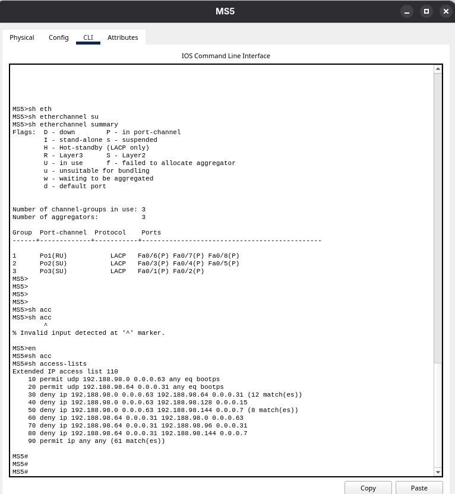
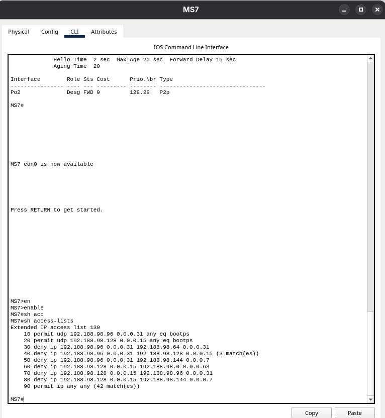
---

## 10. Spanning Tree Protocol

Se utilizó PVST (Per-VLAN Spanning Tree), que mantiene una instancia independiente por cada VLAN.

### Root bridges definidos

| VLAN | Root primario | Root secundario |
|---|---|---|
| 10, 20 | MS5 | MS6 |
| 30, 40 | MS7 | MS8 |

Definir los root bridges manualmente evita que la elección dependa de las direcciones MAC, que es el criterio de desempate por defecto y produce topologías impredecibles.

```
! --- Root primario (MS5) ---
configure terminal
spanning-tree mode pvst
spanning-tree vlan 10,20 root primary
end
write memory

! --- Root secundario (MS6) ---
configure terminal
spanning-tree mode pvst
spanning-tree vlan 10,20 root secondary
end
write memory

! --- Puertos de host en switches de acceso ---
configure terminal
spanning-tree mode pvst
interface range FastEthernet0/2-3
 switchport mode access
 spanning-tree portfast
 spanning-tree bpduguard enable
end
write memory
```

PortFast se habilitó únicamente en los puertos conectados a PCs y laptops. Estos puertos pasan directamente a estado de reenvío en lugar de recorrer los estados de escucha y aprendizaje, lo que evita que las peticiones DHCP expiren durante el arranque. BPDU Guard complementa la medida: si alguien conecta un switch en un puerto de acceso, el puerto se deshabilita automáticamente.

PortFast nunca debe aplicarse a enlaces entre switches. Durante la implementación, un puerto troncal de MS9 quedó en estado `err-disabled` por tener BPDU Guard habilitado, ya que recibía BPDUs legítimos del switch vecino.

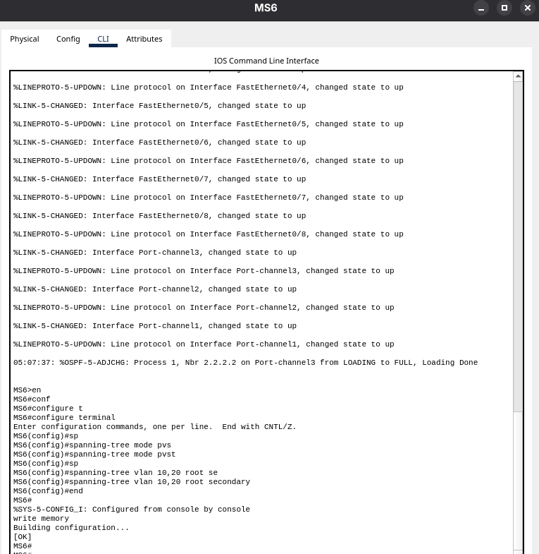
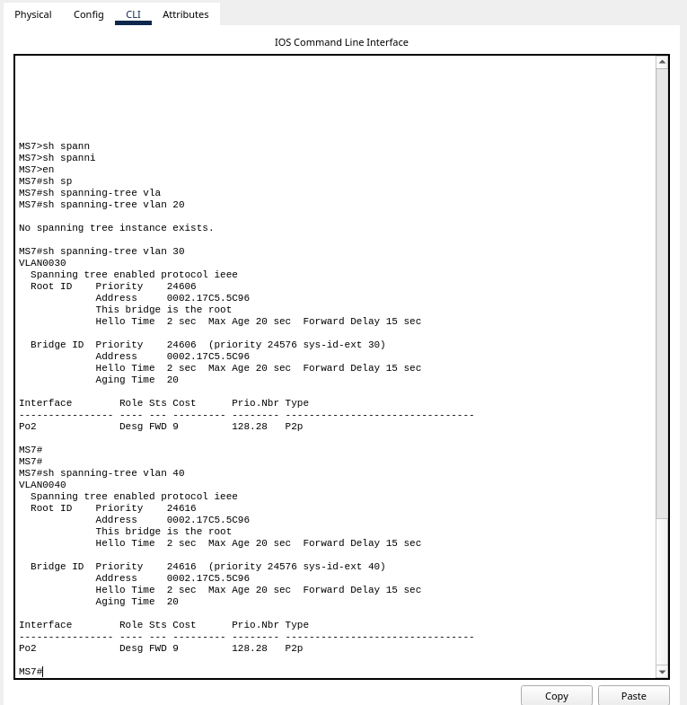
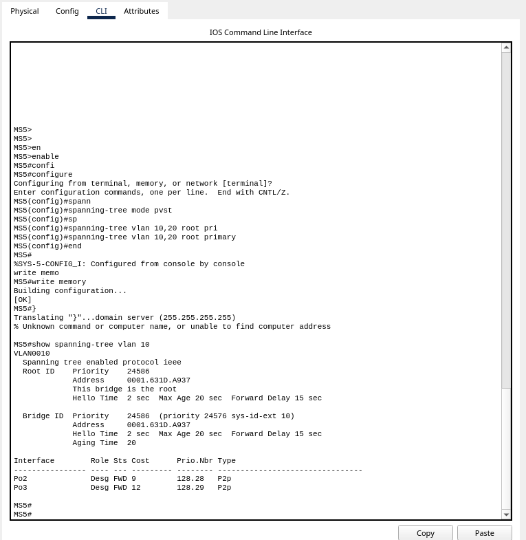
---

## 11. Pruebas de conectividad

| # | Origen | Destino | Resultado esperado |
|---|---|---|---|
| 1 | Naranja IZQ | Naranja DER | Ping exitoso |
| 2 | Verde IZQ | Verde DER | Ping exitoso |
| 3 | Naranja IZQ | Verde IZQ | Bloqueado |
| 4 | Naranja IZQ | Verde DER | Bloqueado |
| 5 | Verde IZQ | Naranja IZQ | Bloqueado |
| 6 | Verde IZQ | Naranja DER | Bloqueado |
| 7 | ADMIN | Naranja IZQ | Ping exitoso |
| 8 | ADMIN | Verde IZQ | Ping exitoso |
| 9 | ADMIN | Naranja DER | Ping exitoso |
| 10 | ADMIN | Verde DER | Ping exitoso |
| 11 | Naranja IZQ | ADMIN | Bloqueado |
| 12 | Verde DER | ADMIN | Bloqueado |

Cuando una ACL descarta un paquete, el ping reporta `Destination host unreachable` desde la dirección del gateway. Esa respuesta confirma que el bloqueo es intencional y controlado, no una falla de enrutamiento.

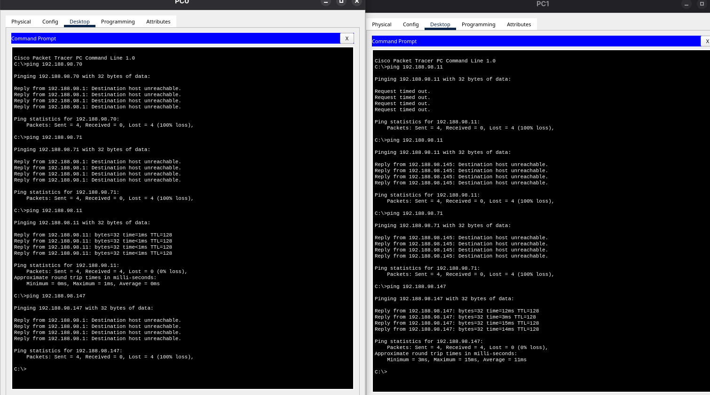
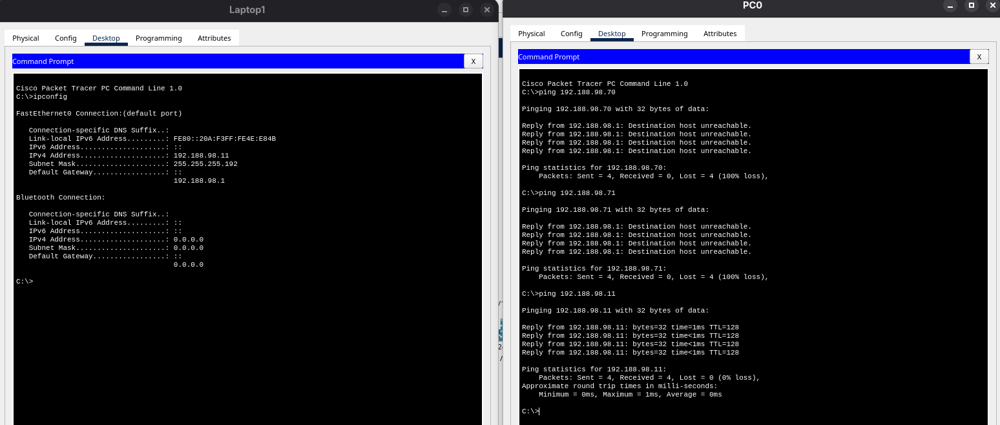
---

## 12. Pruebas de tolerancia a fallos

### Prueba LACP

Con un ping continuo en ejecución entre dos hosts de la misma VLAN en edificios distintos, se deshabilita un puerto físico miembro de un EtherChannel:

```
! En MS5
configure terminal
interface FastEthernet0/6
 shutdown
end

! Verificación
show etherchannel summary

! Restauración
configure terminal
interface FastEthernet0/6
 no shutdown
end
```

El puerto deshabilitado aparece con la bandera (D) mientras los restantes permanecen en (P), y el Port-channel sigue operativo. El tráfico se redistribuye automáticamente entre los enlaces sobrevivientes sin interrupción del servicio.

### Prueba PAgP

El mismo procedimiento en MS7, deshabilitando Fa0/1 del EtherChannel hacia MS3.

---

## 13. Resumen de comandos por área

### Verificación general

```
show running-config
show ip interface brief
show vlan brief
show interfaces status
show interfaces trunk
```

### VTP

```
show vtp status
show vlan brief
```

### EtherChannel

```
show etherchannel summary
show etherchannel port-channel
show interfaces Port-channel1
```

Banderas relevantes: (P) miembro activo en el canal, (D) caído, (I) aislado sin negociar, (S) capa 2, (R) capa 3, (U) en uso.

### OSPF

```
show ip ospf neighbor
show ip ospf interface brief
show ip route ospf
show ip protocols
clear ip ospf process
```

### DHCP

```
show running-config | begin interface Vlan10
ipconfig /release
ipconfig /renew
ipconfig /all
```

### ACLs

```
show access-lists
show running-config | begin interface Port-channel1
```

### Spanning Tree

```
show spanning-tree vlan 10
show spanning-tree summary
show spanning-tree interface FastEthernet0/1
```

### Guardado

```
write memory
copy running-config startup-config
```
